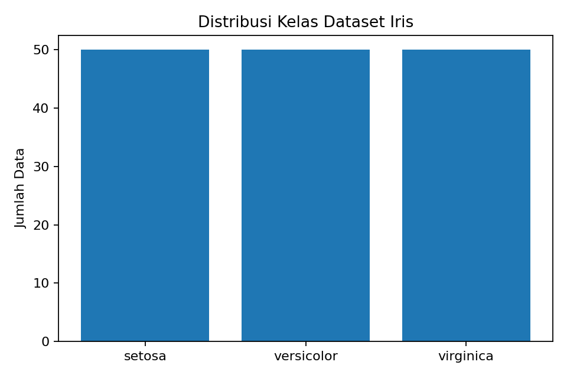
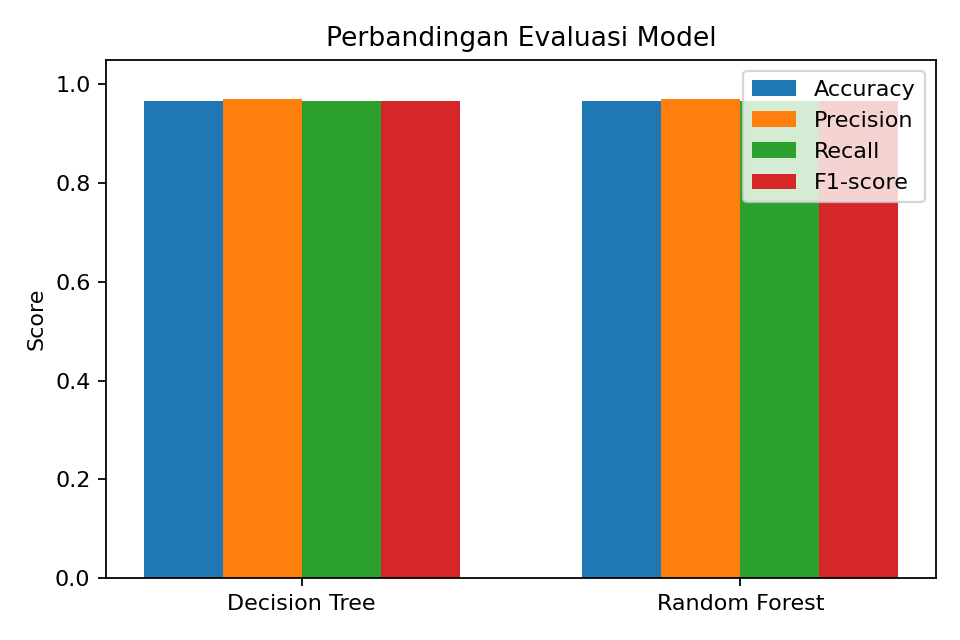
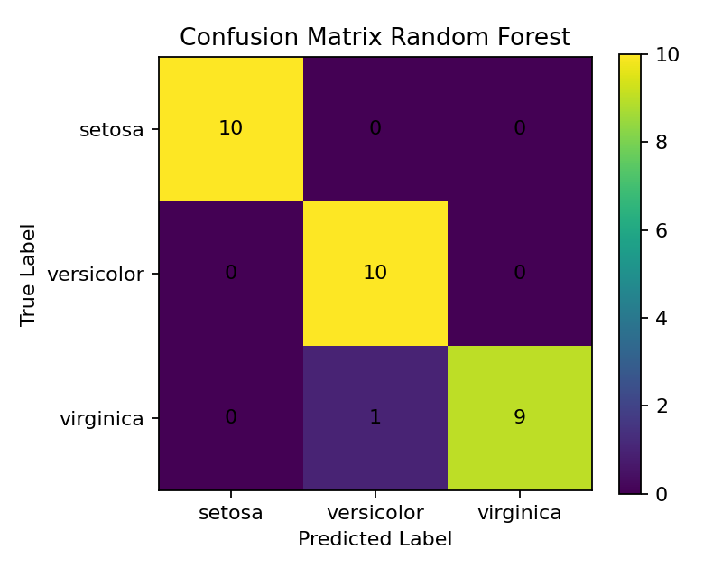

# Laporan Proyek Machine Learning: Klasifikasi Spesies Bunga Iris Menggunakan Decision Tree dan Random Forest

## 1. Domain Proyek

Klasifikasi merupakan salah satu tugas utama dalam machine learning. Teknik ini digunakan untuk mengelompokkan data ke dalam kelas tertentu berdasarkan pola pada fitur yang tersedia. Pada proyek ini, klasifikasi diterapkan untuk mengenali spesies bunga Iris berdasarkan ukuran sepal dan petal.

Dataset Iris dipilih karena memiliki struktur yang sederhana, bersih, dan mudah dipahami. Dataset ini cocok digunakan untuk menjelaskan alur kerja supervised learning karena setiap data sudah memiliki label kelas. Proyek ini dapat menjadi contoh penerapan machine learning dari tahap pemahaman masalah sampai deployment aplikasi.

Permasalahan yang dibahas adalah bagaimana model dapat mengklasifikasikan spesies bunga Iris ke dalam tiga kelas, yaitu setosa, versicolor, dan virginica. Setiap data memiliki empat fitur numerik, yaitu sepal length, sepal width, petal length, dan petal width.

Proyek ini menggunakan dua algoritma, yaitu Decision Tree dan Random Forest. Decision Tree digunakan karena alur keputusannya mudah dipahami. Random Forest digunakan sebagai pembanding karena algoritma ini menggabungkan beberapa pohon keputusan untuk menghasilkan prediksi yang lebih stabil.

## 2. Business Understanding

### 2.1 Problem Statements

Berdasarkan domain proyek yang telah dijelaskan, rumusan masalah pada proyek ini adalah:

1. Bagaimana membangun model machine learning untuk mengklasifikasikan spesies bunga Iris?
2. Bagaimana membandingkan performa model Decision Tree dan Random Forest pada dataset Iris?
3. Bagaimana membuat aplikasi sederhana agar model dapat digunakan untuk melakukan prediksi secara langsung?

### 2.2 Goals

Tujuan dari proyek ini adalah:

1. Membuat model klasifikasi spesies bunga Iris berdasarkan empat fitur numerik.
2. Mengevaluasi performa Decision Tree dan Random Forest.
3. Menentukan performa model berdasarkan accuracy, precision, recall, dan F1-score.
4. Membuat aplikasi deployment menggunakan Streamlit.

### 2.3 Solution Statement

Solusi yang digunakan adalah membangun dua model klasifikasi. Model pertama menggunakan Decision Tree. Model kedua menggunakan Random Forest. Kedua model dilatih menggunakan data latih, lalu diuji menggunakan data uji.

Tahapan solusi dilakukan sebagai berikut:

1. Memuat Iris Dataset dari library scikit-learn.
2. Mengubah dataset ke dalam bentuk DataFrame.
3. Memisahkan fitur dan target.
4. Membagi data menjadi data latih dan data uji.
5. Melatih model Decision Tree dan Random Forest.
6. Mengevaluasi model menggunakan metrik klasifikasi.
7. Menyimpan model dalam format pkl.
8. Membuat aplikasi prediksi menggunakan Streamlit.

## 3. Data Understanding

Dataset yang digunakan adalah Iris Dataset dari library scikit-learn. Dataset ini berisi data bunga Iris dengan empat fitur numerik dan satu target kelas. Dataset memiliki 150 data dan 3 kelas target.

### 3.1 Informasi Dataset

| Keterangan | Nilai |
|---|---|
| Nama dataset | Iris Dataset |
| Sumber dataset | scikit-learn datasets |
| Jumlah data | 150 data |
| Jumlah fitur | 4 fitur |
| Jumlah kelas | 3 kelas |
| Jenis masalah | Klasifikasi |
| Jenis pembelajaran | Supervised Learning |

### 3.2 Fitur Dataset

| Fitur | Keterangan |
|---|---|
| sepal length | Panjang sepal bunga dalam cm |
| sepal width | Lebar sepal bunga dalam cm |
| petal length | Panjang petal bunga dalam cm |
| petal width | Lebar petal bunga dalam cm |

### 3.3 Target Dataset

| Nilai Target | Nama Spesies |
|---|---|
| 0 | setosa |
| 1 | versicolor |
| 2 | virginica |

### 3.4 Kondisi Dataset

Dataset Iris memiliki kondisi data yang baik. Seluruh fitur berbentuk numerik dan tidak terdapat missing value. Dataset juga memiliki jumlah data yang seimbang pada setiap kelas target. Kondisi ini membantu model mempelajari pola dari setiap kelas secara lebih adil.

Kondisi dataset:

- Tidak terdapat missing value.
- Tidak terdapat fitur kategorikal.
- Seluruh fitur berbentuk numerik.
- Dataset memiliki tiga kelas target.
- Setiap kelas memiliki 50 data.

## 4. Exploratory Data Analysis

Exploratory Data Analysis dilakukan untuk memahami karakteristik awal dataset. Analisis dilakukan dengan melihat jumlah data, distribusi kelas, dan peran fitur dalam membedakan spesies.

### 4.1 Distribusi Kelas

Dataset Iris memiliki tiga kelas, yaitu setosa, versicolor, dan virginica. Setiap kelas memiliki jumlah data yang sama, yaitu 50 data. Hal ini menunjukkan bahwa dataset seimbang.



### 4.2 Analisis Fitur

Fitur petal length dan petal width memiliki peran penting dalam membedakan spesies Iris. Spesies setosa memiliki ukuran petal yang lebih kecil dibandingkan versicolor dan virginica. Perbedaan nilai fitur ini membantu model dalam menentukan kelas prediksi.

Fitur sepal length dan sepal width juga digunakan oleh model, tetapi pemisahan kelas berdasarkan sepal biasanya tidak sejelas fitur petal. Oleh karena itu, kombinasi keempat fitur tetap digunakan agar model memiliki informasi yang lebih lengkap.

## 5. Data Preparation

Tahap data preparation dilakukan untuk menyiapkan dataset sebelum proses modeling. Karena dataset Iris sudah bersih, tahap ini tidak membutuhkan proses pembersihan yang rumit.

Langkah data preparation yang dilakukan adalah:

1. Memuat dataset Iris.
2. Mengubah data menjadi DataFrame.
3. Memisahkan fitur dan target.
4. Membagi data menjadi data latih dan data uji.
5. Menggunakan rasio 80 persen data latih dan 20 persen data uji.
6. Menggunakan stratify agar distribusi kelas tetap seimbang pada data latih dan data uji.

Kode pembagian data:

```python
X_train, X_test, y_train, y_test = train_test_split(
    X,
    y,
    test_size=0.2,
    random_state=1,
    stratify=y
)
```

Pembagian data dilakukan agar model dapat belajar dari data latih dan diuji menggunakan data yang belum pernah dilihat saat training. Hal ini penting untuk mengetahui kemampuan model dalam melakukan generalisasi.

## 6. Modeling

Tahap modeling dilakukan dengan membangun dua algoritma klasifikasi, yaitu Decision Tree dan Random Forest.

### 6.1 Decision Tree

Decision Tree merupakan algoritma klasifikasi yang membuat struktur pohon keputusan berdasarkan pemisahan fitur. Model ini menentukan keputusan secara bertahap dari node awal sampai node akhir.

Kelebihan Decision Tree:

- Mudah dipahami.
- Alur keputusan dapat dijelaskan.
- Cocok untuk data numerik.
- Tidak membutuhkan normalisasi data.

Kekurangan Decision Tree:

- Rentan mengalami overfitting.
- Hasil model dapat berubah jika data latih berubah.
- Performa dapat menurun pada data yang lebih kompleks.

### 6.2 Random Forest

Random Forest merupakan algoritma ensemble yang membangun banyak Decision Tree. Hasil prediksi diperoleh dari gabungan keputusan beberapa pohon. Algoritma ini sering menghasilkan performa yang lebih stabil dibandingkan satu Decision Tree.

Kelebihan Random Forest:

- Lebih stabil dibandingkan Decision Tree tunggal.
- Dapat mengurangi risiko overfitting.
- Cocok untuk klasifikasi.
- Dapat bekerja dengan baik pada dataset kecil sampai menengah.

Kekurangan Random Forest:

- Lebih sulit dijelaskan dibandingkan Decision Tree.
- Membutuhkan proses komputasi lebih besar.
- Struktur model lebih kompleks.

## 7. Evaluation

Evaluasi dilakukan menggunakan accuracy, precision, recall, dan F1-score. Metrik tersebut digunakan untuk mengukur performa model dalam mengklasifikasikan data uji.

Penjelasan metrik:

- Accuracy mengukur jumlah prediksi benar dibandingkan seluruh data uji.
- Precision mengukur ketepatan prediksi model pada setiap kelas.
- Recall mengukur kemampuan model menemukan data pada kelas yang benar.
- F1-score mengukur keseimbangan antara precision dan recall.

### 7.1 Hasil Evaluasi

| Model | Accuracy | Precision | Recall | F1-score |
|---|---:|---:|---:|---:|
| Decision Tree | 0.966667 | 0.969697 | 0.966667 | 0.966583 |
| Random Forest | 0.966667 | 0.969697 | 0.966667 | 0.966583 |



### 7.2 Confusion Matrix

Confusion matrix digunakan untuk melihat jumlah prediksi benar dan salah pada setiap kelas. Pada proyek ini, Random Forest menunjukkan hasil klasifikasi yang baik pada data uji.



### 7.3 Analisis Hasil Evaluasi

Hasil evaluasi menunjukkan bahwa Decision Tree dan Random Forest memperoleh nilai performa yang sama pada data uji. Keduanya memperoleh accuracy sebesar 0.966667. Nilai precision, recall, dan F1-score juga menunjukkan performa yang seimbang.

Berdasarkan hasil tersebut, kedua model dapat digunakan untuk klasifikasi spesies bunga Iris. Pada aplikasi deployment, pengguna dapat memilih model yang ingin digunakan. Hal ini membuat aplikasi lebih fleksibel dan memudahkan perbandingan hasil prediksi.

## 8. Deployment

Deployment dilakukan menggunakan Streamlit. Aplikasi dibuat agar pengguna dapat melakukan prediksi langsung melalui browser. Pengguna memasukkan empat nilai fitur, yaitu sepal length, sepal width, petal length, dan petal width. Setelah itu, pengguna memilih model dan menekan tombol prediksi.

### 8.1 Cara Menjalankan Aplikasi

Install library:

```bash
pip install -r requirements.txt
```

Jalankan aplikasi:

```bash
python -m streamlit run app.py
```

Aplikasi akan berjalan pada alamat berikut:

```bash
http://localhost:8501
```

### 8.2 Input Aplikasi

Aplikasi menerima input berikut:

| Input | Keterangan |
|---|---|
| Sepal length | Panjang sepal |
| Sepal width | Lebar sepal |
| Petal length | Panjang petal |
| Petal width | Lebar petal |
| Model | Pilihan Decision Tree atau Random Forest |

### 8.3 Output Aplikasi

Output aplikasi berupa hasil prediksi spesies bunga Iris. Hasil prediksi dapat berupa setosa, versicolor, atau virginica.

## 9. Struktur Repository

```text
proyek-ml-klasifikasi-iris/
│
├── README.md
├── laporan_submission_iris.md
├── klasifikasi_iris.ipynb
├── app.py
├── train_model.py
├── requirements.txt
├── script_presentasi.md
│
├── data/
│   └── iris_dataset.csv
│
├── models/
│   ├── decision_tree_model.pkl
│   └── random_forest_model.pkl
│
├── reports/
│   └── evaluation_results.md
│
└── images/
    ├── class_distribution.png
    ├── model_comparison.png
    └── confusion_matrix_random_forest.png
```

## 10. Kesimpulan

Proyek ini berhasil membangun model klasifikasi spesies bunga Iris menggunakan Decision Tree dan Random Forest. Dataset yang digunakan memiliki 150 data, 4 fitur numerik, dan 3 kelas target. Proyek disusun menggunakan metodologi CRISP-DM, mulai dari business understanding, data understanding, data preparation, modeling, evaluation, sampai deployment.

Hasil evaluasi menunjukkan bahwa Decision Tree dan Random Forest memperoleh performa yang baik. Kedua model memperoleh accuracy sebesar 0.966667, precision sebesar 0.969697, recall sebesar 0.966667, dan F1-score sebesar 0.966583.

Aplikasi deployment berbasis Streamlit juga berhasil dibuat. Aplikasi ini memungkinkan pengguna memasukkan nilai fitur bunga Iris dan memperoleh hasil prediksi spesies secara langsung melalui browser.

## 11. Referensi

1. Scikit-learn Documentation. Iris plants dataset.
2. Scikit-learn Documentation. DecisionTreeClassifier.
3. Scikit-learn Documentation. RandomForestClassifier.
4. Scikit-learn Documentation. Model evaluation.
5. Streamlit Documentation.
